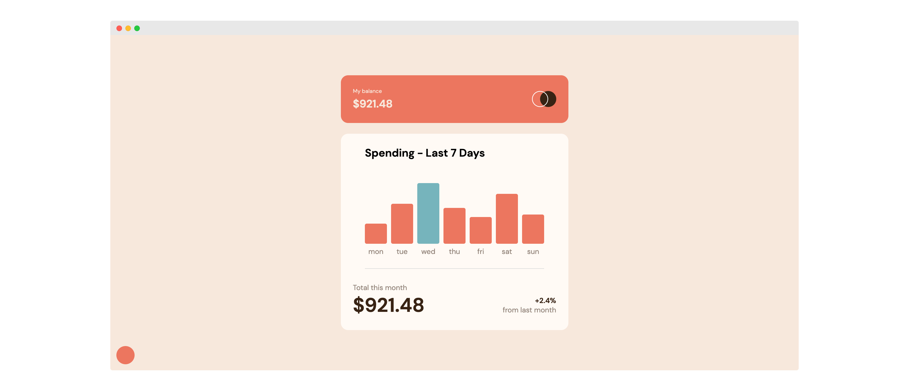

# Frontend Mentor - Expenses chart component solution

This is a solution to the [Expenses chart component challenge on Frontend Mentor](https://www.frontendmentor.io/challenges/expenses-chart-component-e7yJBUdjwt). Frontend Mentor challenges help you improve your coding skills by building realistic projects.

## Table of contents

- [Frontend Mentor - Expenses chart component solution](#frontend-mentor---expenses-chart-component-solution)
  - [Table of contents](#table-of-contents)
  - [Overview](#overview)
    - [The challenge](#the-challenge)
    - [Screenshot](#screenshot)
    - [Links](#links)
    - [Built with](#built-with)
    - [Useful resources](#useful-resources)
  - [Author](#author)

## Overview

### The challenge

Users should be able to:

- View the bar chart and hover over the individual bars to see the correct amounts for each day ✅
- See the current day’s bar highlighted in a different colour to the other bars ✅
- View the optimal layout for the content depending on their device’s screen size ✅
- See hover states for all interactive elements on the page ✅
- **Bonus**: Use the JSON data file provided to dynamically size the bars on the chart ✅

### Screenshot

### Links

- Solution URL: [Add solution URL here](https://your-solution-url.com)
- Live Site URL: [Add live site URL here](https://your-live-site-url.com)

### Built with

- Semantic HTML5 markup
- CSS custom properties
- Flexbox
- CSS Grid
- JavsScript (ES6)

### Useful resources

- [Stackoverflow](https://stackoverflow.com/questions/16261504/make-div-element-receive-focus) - This helped me for add focus states to a div element
- [Stackoverflow](https://stackoverflow.com/questions/24998624/day-name-from-date-in-js) - This helped me to get the day name from a date whitout using a library or internationalization

## Author

- Website - [Fabrizio Signoretta](https://fabriziosignoretta.me)
- Frontend Mentor - [@fabroos](https://www.frontendmentor.io/profile/fabroos)
- LinkedIn - [signorettafabrizio](https://www.linkedin.com/in/signorettafabrizio/)
